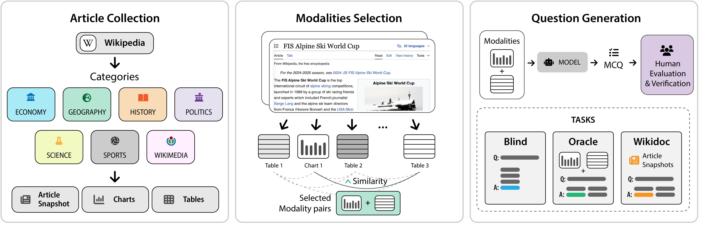

  <!--  -->
  
  

# WikiMixQA: A Multimodal Benchmark for Question Answering over Tables and Charts

  

<!--   -->

Code an model for paper: "[WikiMixQA: A Multimodal Benchmark for Question Answering over Tables and Charts](https://arxiv.org/abs/2506.15594)" arXiv - 2025

This repository will be updated soon!